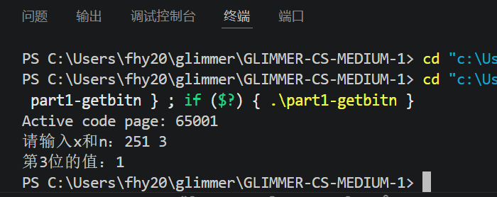
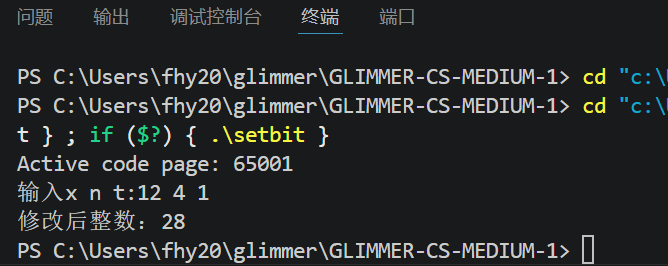
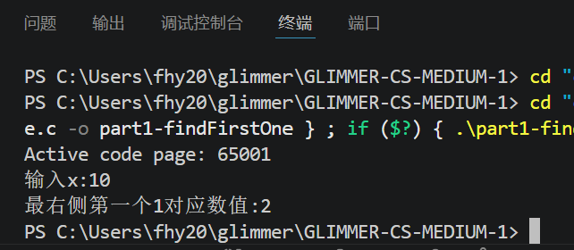
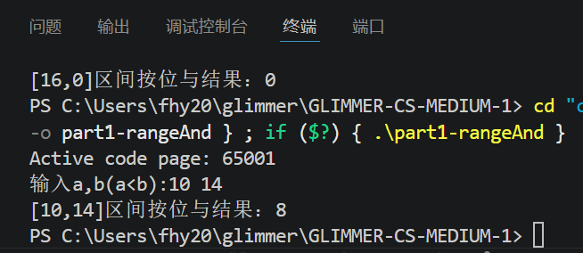

# 任务2 
## 1、推导代码输出结果
```c
#include <stdio.h>
int main() {
    unsigned char a = 12;  // 二进制：00001100
    unsigned char b = 25;  // 二进制：00011001

    unsigned char res1 = a & b;
    unsigned char res2 = a | b;
    unsigned char res3 = a ^ b;
    unsigned char res4 = (a << 2) | (b >> 1);

    printf("%d %d %d %d\n", res1, res2, res3, res4);
    return 0;
}
```
### 推导
- a = 12 → 00001100
- b = 25 → 00011001
1. res1 = a & b（按位与：同1才为1）
00001100 & 00011001 = 00001000 → **8**
2. res2 = a | b（按位或：有1就为1）
00001100 | 00011001 = 00011101 → **29**
3. res3 = a ^ b（按位异或：不同为1，相同为0）
00001100 ^ 00011001 = 00010101 → **21**
4. res4 = (a << 2) | (b >> 1)
    - a << 2：00001100左移2位 → 00110000
    - b >> 1：00011001右移1位 → 00001100
    - 或运算：00110000 | 00001100 = 00111100 → **60**

程序输出：8 29 21 60

---

## 2、题目2：获取整数x二进制第n位（返回0或1）

```c
#include <stdio.h>

// 获取x的第n位的函数
int getBit(int x, int n)
{
    return (x >> n) & 1;  //ps: 最低位规定为第0位，所以实际上要右移n位后，最低位才为所需的
}

int main()
{
    int x, n;
    printf("请输入x和n：");
    scanf("%d %d", &x, &n);
    int ans = getBit(x, n);
    printf("第%d位的值：%d\n", n, ans);
    return 0;
}
```
测试样例：输入 251 3，输出 0。
## ps 我这里默认的最低位为第0位，后面会改，这里将就了


---

## 3、题目3：修改x二进制第n位为t（t只能是0或1）
```c
#include <stdio.h>

// 将x第n位设置为t（t=0或1）
int setBit(int x, int n, int t)
{
    if(t == 1)
    {
        return x | (1 << n);  // 必定是1，故或是1
    }
    else
    {
        return x & ~(1 << n); // 很巧妙，先做一个掩码，掩码为0的位按位与后必定为0，达到了修改的效果，同时又不改变x的其他位
    }                         //eg,如果x某位为0，0&1=1，若某位为1，1&1=1，不影响原来的
}

int main()
{
    int x, n, t;
    printf("输入x n t：");
    scanf("%d %d %d", &x, &n, &t);
    int ans = setBit(x, n, t);
    printf("修改后整数：%d\n", ans);
    return 0;
}
```

---

## 4、题目4：找到有符号32位整数从右开始第一个1，输出该值
```c
#include <stdio.h>

int findFirstOne(int x)
{
    return x & -x;//又是一个相当巧妙的，x与自己的补码做按位与，剩下的必然是最右侧的一个1，eg -x=0110,x=1010,ret=0010->2
}

int main()
{
    int x;
    printf("输入x：");
    scanf("%d", &x);
    int ans = findFirstOne(x);
    printf("最右侧第一个1对应数值：%d\n", ans);
    return 0;
}
```
测试：输入 10 → 输出 2


---

## 5、题目5：区间 [a,b] 所有数字按位与的结果
特殊性质：连续区间不断按位与，高位不变，低位全部变成0。
思路：不断右移a、b直到a==b，记录移位次数，最后左移回去。
```c
#include <stdio.h>
//a 到 b 所有数连续按位与，结果等于 a 和 b 从高位开始，最长公共前缀，后面所有 bit 全部置 0。
//原理：只要区间内存在两个数，某一位一个是 0 一个是 1，这一位的最终 & 结果一定是 0。只要 a≠b，中间一定会发生进位，进位位置会翻 0。
unsigned int rangeAnd(unsigned int a, unsigned int b)
{
    int shift = 0;
    while(a != b)//直到相等
    {
        a >>= 1;
        b >>= 1;   //同步右移，就是为了找到最长公共前缀
        shift++;
    }
    return a << shift;  //最长公共前缀低位补零，完成
}

int main()
{
    unsigned int a,b;
    printf("输入a,b（a<b）：");
    scanf("%u %u", &a, &b);
    unsigned int ans = rangeAnd(a,b);
    printf("[%u,%u]区间按位与结果：%u\n", a,b,ans);
    return 0;
}
```

---

# 思考题(PS 此部分参考资料：《深入理解计算机系统》第二章)
### 思考题1：逻辑运算和位运算的区别与联系
**联系**：都属于布尔相关运算，结果只有真/假概念，都可以做条件判断。
**区别**
1. **逻辑运算（&& || !）**：操作整个表达式，把整个值当成布尔（非0为真，0为假）。运算结果只有0或1。
  5 && 3 → 1；一旦前面能确定结果，后面代码不执行。
1. **位运算（& | ^ ~）**：对每一位二进制单独运算，不是整体真假；每一位都参与计算。
  5 & 3 = 1，是二进制逐位计算。

conclusion：逻辑运算是整体判断真假；位运算是二进制每一位单独计算。

### 思考题2：位运算常见性质
1. 交换律：a & b = b & a；a | b = b | a；a ^ b = b ^ a
2. 结合律：(a & b) & c = a & (b & c)，或、异或同理
3. 分配律：a & (b | c) = (a & b) | (a & c)
4. 归零：a ^ a = 0；a & a = a；a | a = a
5. 恒等：a ^ 0 = a；a | 0 = a；a & 0 = 0
6. 吸收律：a & (a | b) = a；a | (a & b) = a

### 思考题3：算术右移 和 逻辑右移 的区别，为什么有符号/无符号区分
1. **逻辑右移（无符号unsigned）**：右边丢弃，左边统一补 0。不管正负，高位永远填0。
2. **算术右移（有符号signed，补码存储）**：右边丢弃，**左边补符号位**（正数补0，负数补1）。
 原因：计算机中有符号整数用**补码**保存。算术右移需要保证**负数右移后仍然保持符号不变**，相当于除以2向下取整。
 如果负数补码使用逻辑右移，高位补0，数字符号直接变正数，结果完全错误。所以：
 conclusion:
- 无符号数：没有正负，用**逻辑右移**，高位补0
- 有符号数：存在负数，用**算术右移**，高位补符号位


