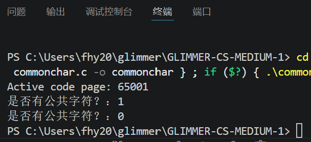

## 1.代码及理解
```c
#include <stdio.h>
// 函数：判断两个字符串是否有公共字符，也是相当巧妙，通过掩码的不同位置进行了标记，而以a为基准，32位够了，女少。
//ps 严格按照本题的要求空间复杂度严格为 O(1)，时间复杂度为O(N)。故不能用数组
int hasCommonChar(const char *s1, const char *s2) {
    int mask1 = 0; 
    int mask2 = 0;  

    // 遍历第一个字符串s1，直到读到字符串结束符'\0'为止
    while(*s1 != '\0'){
        // *s1 拿到当前字符，减去'a'，算出字母偏移：eg `h`-`a`=104-97=7
        int bit = *s1 - 'a';
        // 1 << bit：数字1左移bit位，只有目标字母对应的那一位是1
        // |= 按位或：把mask1对应的bit置1，已经是1的位保持不变,因为是或
        mask1 |= (1 << bit);
        s1++; // 指针向后移动，读取下一个字符
    }

    // 遍历第二个字符串s2，同理
    while(*s2 != '\0'){
        int bit = *s2 - 'a';
        mask2 |= (1 << bit);
        s2++;
    }

    // 按位与 &：只有mask1和mask2同一bit都等于1，结果该位才为1，说明存在公共字母
    if( (mask1 & mask2) != 0 ){
        return 1;  // 有公共字符，返回1
    }else{
        return 0;  // 无公共字符，返回0
    }
}


int main(){
    char s1[] = "hello";
    char s2[] = "world";
    printf("是否有公共字符？：%d\n", hasCommonChar(s1,s2)); //样例1：输出1，存在公共字符 l、o

    char s3[] = "abc";
    char s4[] = "xyz";
    printf("是否有公共字符？：%d\n", hasCommonChar(s3,s4)); //样例2：输出0，没有公共字符
    return 0;
}
```
## 2.输出结果：
