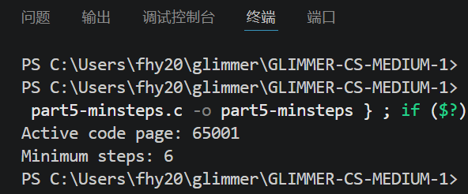

# 我对 minsteptocheese 的理解
## 我觉得共有以下几个很关键或者说很巧妙的点，如下（未参考AI）
## 1.遍历方式很巧妙
题目其实是一个二维的图，而程序利用dr和dc两个数组的遍历，巧妙遍历了上下左右四个方向
## 2.利用判定很关键，
用visit判定走过这里，用wall标识禁区，这里就是运用了本章节前面题的原理
## 3.存入和取出很关键
程序用的是front和rear，我的理解如下：
BFS 就像**往水池里丢一颗石子，波纹一圈一圈向外扩散**：

- 起点就是石子落水点（步数 0）
- 每一圈波纹，就是相同步数能到达的所有格子
- 波纹向外扩散时，碰到墙 / 已经流过的地方就停止，不会重复流
- 水池里还没扩散完的波纹，就放在队列里（`rear-front`就是当前待扩散的波纹数量）
- `front`负责取出当前这一圈的波纹点，向外试探；能流过去的新位置，就加到队列末尾（`rear++`）
- 当所有波纹全部扩散完毕，没有地方可以再流了，`front`追上`rear`，搜索结束。
  
## conclusion
相当于这是一个动态的过程，每一次进行4个方向的遍历，会存入可行的新位置到数组，
并用rear标示，front去追赶，直到无路可走或是找到最短路径

## 运行结果
